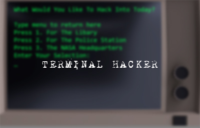
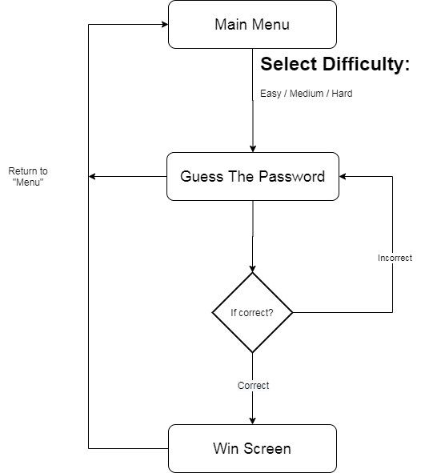

# Termaial Hacker Game
Game created with the help of Udemy's "Complete C# Unity Developer 3D" course.

<p align='center'>
    
</p>

# Lecture notes:

## I. Simple Approach To Game Design:

```
Intention -> Execution
```

**Intention:** What are we trying to do? Expect to iterate.

**Execution:** Try to match our Intention as best we can.

## II. Termaial Game Design Intention:

**Player Experience:**
Like an old school hacker

**Core Mechanic:**
Anagram guessing game.
as ```lbaet = table```

**Core game loop:**
Player is shown scrambled word and asked to guess. They have as many guesses as they need. When guessed accurately, they "Win".

## III. Terminal Hacker Game Flow And Screens
<p align='center'>
    
</p>